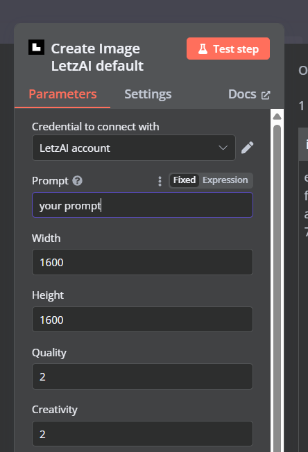
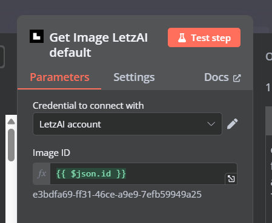
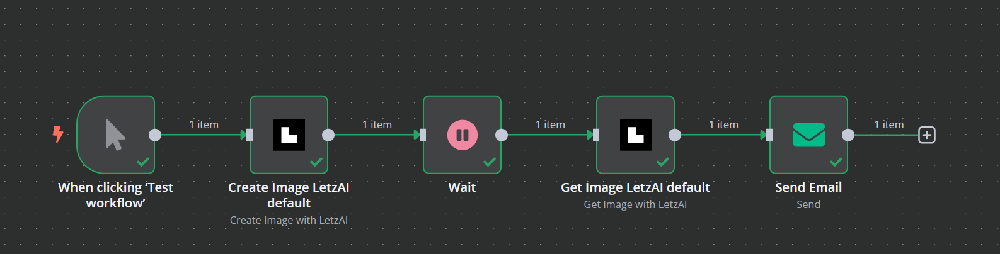

# n8n-nodes-letzai

This is an n8n community node. It lets you use LetzAI in your n8n workflows.

[LetzAI](https://letz.ai) is an image generation platform that allows users to create images using AI. With this integration, you can generate images by providing prompts and also retrieve previously generated images using your API key.

[n8n](https://n8n.io/) is a [fair-code licensed](https://docs.n8n.io/reference/license/) workflow automation platform.

[Installation](#installation)  
[Operations](#operations)  
[Credentials](#credentials) <!-- delete if no auth needed -->  
[Compatibility](#compatibility)  
[Usage](#usage) <!-- delete if not using this section -->  
[Resources](#resources)

## Installation

Follow the [installation guide](https://docs.n8n.io/integrations/community-nodes/installation/) in the n8n community nodes documentation.

## Operations

Operations Supported by LetzAI Node:

1. **Get Image** – Retrieve previously generated images from the LetzAI platform using the image ID.
2. **Create Image** – Generate a new image using a custom prompt through the LetzAI API.

## Credentials

To use the LetzAI service, you will need to authenticate yourself with an API key.

1. **Create an Account**: Sign up on [LetzAI](https://letz.ai/).
2. **Subscription**: After signing up, go to [LetzAI Subscription](https://letz.ai/subscription) and choose a subscription plan.
3. **Get Your API Key**: Once subscribed, you'll find your API key on the [LetzAI Subscription page](https://letz.ai/subscription).

You will authenticate by passing the API key in the credentials apiKey input.

## Compatibility

- **Minimum n8n version**: Unknown
- **Tested against**: 1.84.1
- **Known issues**: No known incompatibility issues with version 1.84.1.

## Usage

- To use this node, search for "Create Image LetzAI" in the n8n nodes and add it to your workflow. This node will generate an image based on the provided prompt.
  
- After generating the image, use a **Wait node** in your workflow to wait for 2-4 minutes. This is necessary to give LetzAI some time to process the image generation.
- Once the wait time is over, add the **Get Image LetzAI** node to your workflow. In the "Image ID" field, use the ID from the "Create Image LetzAI" node’s output. This will fetch the generated image based on the ID.
  

For a step-by-step guide, refer to the [Try it out](https://docs.n8n.io/try-it-out/) documentation to help you get started with n8n workflows.

## Resources

- [n8n community nodes documentation](https://docs.n8n.io/integrations/community-nodes/)
- [LetzAI API Documentation](https://letz.ai/docs/api)
